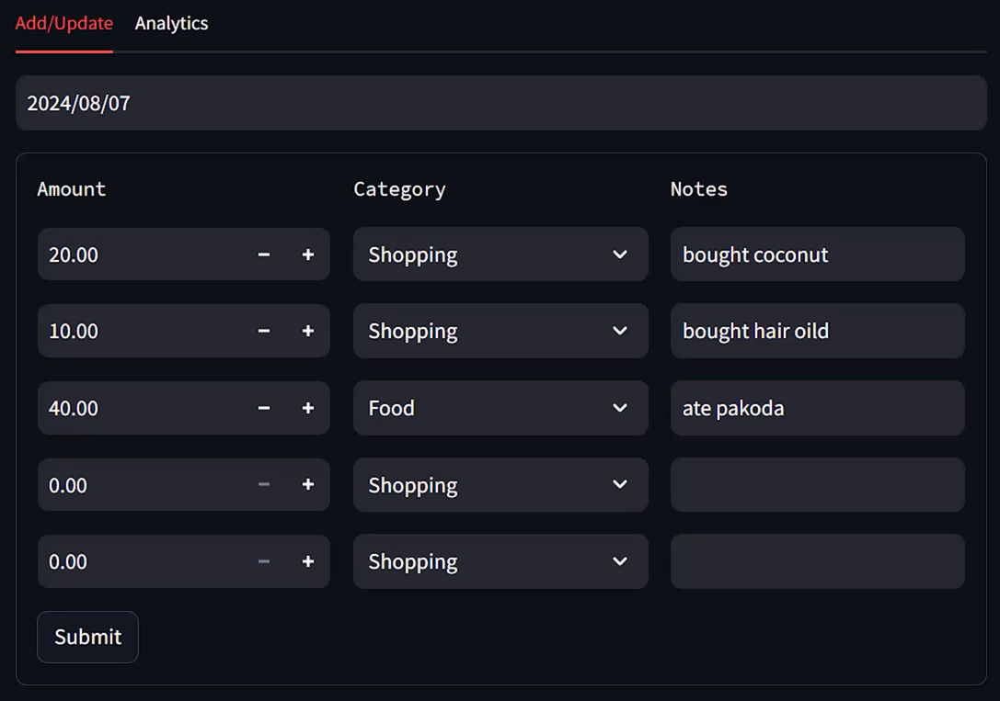
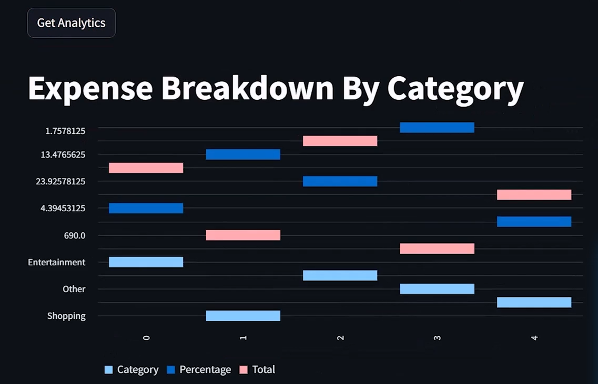
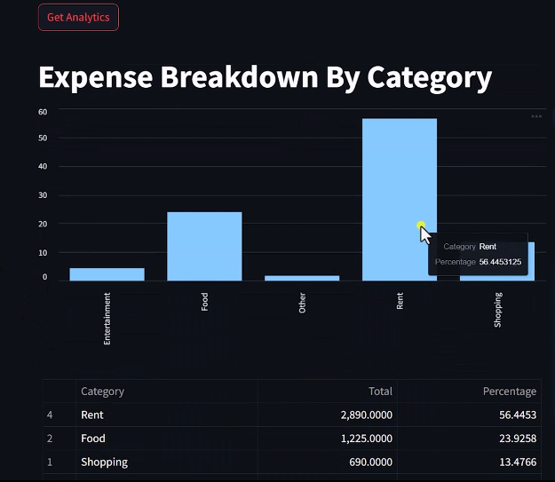

# Expense Management System

A full-stack personal expense tracking application built with
**Streamlit**, **FastAPI**, and **MySQL**. The application lets users
record and update daily expenses and analyze spending across a selected
date range.

## Overview

The project follows a simple frontend/backend architecture:

-   **Streamlit** provides the interactive user interface.
-   **FastAPI** exposes REST API endpoints for expense operations and
    analytics.
-   **MySQL** stores the expense records.
-   **Pandas** is used to prepare analytics data for display.
-   **Pytest** is used for backend database-helper tests.

The application has two main UI sections:

1.  **Add/Update** --- enter or modify expenses for a selected date.
2.  **Analytics** --- view total spending and percentage breakdown by
    category over a date range.

------------------------------------------------------------------------

## Features

### Expense Management

-   Select a date and retrieve existing expenses.
-   Add or update multiple expenses for a day.
-   Record:
    -   Amount
    -   Category
    -   Notes
-   Supported categories:
    -   Rent
    -   Food
    -   Shopping
    -   Entertainment
    -   Other
-   Empty expense rows are automatically ignored when submitting.

### Expense Analytics

-   Select a start and end date.
-   Calculate total spending by category.
-   Calculate each category's percentage of total spending.
-   Display the results as:
    -   A bar chart
    -   A sortable analytics table

### Backend API

The FastAPI backend provides endpoints for: - Retrieving expenses for a
specific date - Adding/updating expenses for a specific date -
Generating category-based expense analytics

### Testing

The project includes Pytest tests covering database-helper functionality
such as: - Retrieving expenses for a date - Handling dates with no
expenses - Handling analytics ranges with no data

------------------------------------------------------------------------

## Tech Stack

  Technology               Purpose
  ------------------------ ----------------------------------------
  Python                   Application programming language
  Streamlit                Frontend / UI
  FastAPI                  Backend REST API
  MySQL                    Database
  MySQL Connector/Python   Database connectivity
  Pandas                   Analytics data processing
  Requests                 Frontend-to-backend HTTP communication
  Pydantic                 API request/response data validation
  Uvicorn                  ASGI server for FastAPI
  Pytest                   Testing

------------------------------------------------------------------------

## Architecture

``` text
                    ┌─────────────────────┐
                    │   Streamlit UI      │
                    │   frontend/app.py   │
                    └──────────┬──────────┘
                               │
                     HTTP requests
                               │
                               ▼
                    ┌─────────────────────┐
                    │     FastAPI API     │
                    │   backend/server.py  │
                    └──────────┬──────────┘
                               │
                               ▼
                    ┌─────────────────────┐
                    │     db_helper.py    │
                    │ Database operations │
                    └──────────┬──────────┘
                               │
                               ▼
                    ┌─────────────────────┐
                    │       MySQL         │
                    │  expense_manager DB │
                    └─────────────────────┘
```

The Streamlit frontend does not communicate directly with MySQL.
Instead, it sends HTTP requests to the FastAPI backend, which handles
database operations through `db_helper.py`.

------------------------------------------------------------------------

## Project Structure

``` text
Expense-Tracking-System/
│
├── backend/
│   ├── db_helper.py
│   ├── logging_setup.py
│   └── server.py
│
├── frontend/
│   ├── add_update_ui.py
│   ├── analytics_ui.py
│   └── app.py
│
├── tests/
│   ├── backend/
│   │   └── test_db_helper.py
│   └── conftest.py
│
├── analytics_ui_demo1.png
├── analytics_ui_demo2.png
├── app_frontend_ui.png
├── requirements.txt
└── README.md
```

Generated files such as `__pycache__`, `.pytest_cache`, and log files
are excluded from version control through `.gitignore`.

------------------------------------------------------------------------

## Prerequisites

Before running the project, install:

-   Python 3.10+ recommended
-   MySQL Server
-   Git

Check your Python installation:

``` bash
python --version
```

Check MySQL:

``` bash
mysql --version
```

------------------------------------------------------------------------

## Database Setup

The application expects a MySQL database named:

``` text
expense_manager
```

and an `expenses` table containing at least these columns:

``` text
expense_date
amount
category
notes
```

Example schema:

``` sql
CREATE DATABASE expense_manager;

USE expense_manager;

CREATE TABLE expenses (
    id INT AUTO_INCREMENT PRIMARY KEY,
    expense_date DATE NOT NULL,
    amount DECIMAL(10, 2) NOT NULL,
    category VARCHAR(100) NOT NULL,
    notes VARCHAR(255)
);
```

### Database Configuration

The current project uses local-development database configuration in
`backend/db_helper.py`.

The values in the repository are placeholder/local-development values
and are **not real personal credentials**.

For a production deployment, database credentials should be provided
through environment variables or a secrets manager rather than being
stored directly in source code.

------------------------------------------------------------------------

## Installation

### 1. Clone the repository

``` bash
git clone https://github.com/Animesh-png/Expense-Tracking-System.git
cd Expense-Tracking-System
```

### 2. Create a virtual environment

Windows:

``` bash
python -m venv venv
venv\Scripts\activate
```

macOS/Linux:

``` bash
python3 -m venv venv
source venv/bin/activate
```

### 3. Install dependencies

``` bash
pip install -r requirements.txt
```

------------------------------------------------------------------------

## Running the Application

The application consists of two processes: the FastAPI backend and the
Streamlit frontend.

### 1. Start the FastAPI backend

Open a terminal in the project root:

``` bash
cd backend
uvicorn server:app --reload
```

The API will be available at:

``` text
http://localhost:8000
```

FastAPI also provides interactive API documentation at:

``` text
http://localhost:8000/docs
```

### 2. Start the Streamlit frontend

Open a **second terminal** in the project root:

``` bash
streamlit run frontend/app.py
```

Streamlit will provide a local URL, typically:

``` text
http://localhost:8501
```

Keep both the FastAPI and Streamlit processes running while using the
application.

------------------------------------------------------------------------

## API Endpoints

### Get expenses for a date

``` http
GET /expenses/{expense_date}
```

Example:

``` text
GET /expenses/2024-08-15
```

Returns the expenses stored for the specified date.

### Add or update expenses

``` http
POST /expenses/{expense_date}
```

The endpoint replaces the existing expenses for that date with the
submitted expense list.

Example request body:

``` json
[
  {
    "amount": 250.0,
    "category": "Food",
    "notes": "Groceries"
  },
  {
    "amount": 100.0,
    "category": "Shopping",
    "notes": "Household items"
  }
]
```

### Get analytics

``` http
POST /analytics/
```

Example request:

``` json
{
  "start_date": "2024-08-01",
  "end_date": "2024-08-31"
}
```

The endpoint returns the total and percentage contribution of each
expense category.

------------------------------------------------------------------------

## Application Flow

### Add / Update Expenses

``` text
User selects a date
        ↓
Streamlit requests existing expenses
        ↓
FastAPI receives GET request
        ↓
db_helper queries MySQL
        ↓
Existing expenses displayed
        ↓
User enters/updates expenses
        ↓
Streamlit sends POST request
        ↓
FastAPI deletes old records for the date
        ↓
FastAPI inserts the submitted expenses
        ↓
MySQL stores the updated data
```

### Analytics

``` text
User selects date range
        ↓
Streamlit sends analytics request
        ↓
FastAPI queries MySQL
        ↓
Expenses grouped by category
        ↓
Total + percentage calculated
        ↓
Streamlit displays chart + table
```

------------------------------------------------------------------------

## Screenshots

### Expense Entry Interface



### Analytics View





------------------------------------------------------------------------

## Running Tests

From the project root:

``` bash
pytest
```

The backend tests currently verify database-helper behavior, including:

-   Retrieving a known expense record
-   Returning no records for a date with no expenses
-   Returning no analytics records for an empty date range

### Test Data

The existing tests expect specific database records to already exist.
For example, one test expects a Shopping expense on `2024-08-15`.

Therefore, configure the MySQL database and test data before running the
complete test suite.

------------------------------------------------------------------------

## Configuration Notes

The frontend currently expects the FastAPI server at:

``` text
http://localhost:8000
```

This URL is defined in:

``` text
frontend/add_update_ui.py
frontend/analytics_ui.py
```

For a more configurable deployment, this could later be moved to an
environment variable.

------------------------------------------------------------------------

## Current Limitations

-   The application currently uses a local MySQL database.
-   The API URL is hard-coded to `localhost:8000`.
-   Database configuration is intended for local development.
-   Authentication and authorization are not implemented.
-   The backend does not currently expose a dedicated health-check
    endpoint.
-   The test suite depends on expected database data.

------------------------------------------------------------------------

## Future Improvements

Potential improvements include:

-   Move database credentials to environment variables.
-   Add user authentication and authorization.
-   Add database migrations.
-   Add more comprehensive frontend and API tests.
-   Add API health checks.
-   Containerize the application with Docker.
-   Add CI/CD using GitHub Actions.
-   Deploy the backend and frontend to a cloud platform.
-   Add additional analytics such as:
    -   Monthly spending trends
    -   Budget vs. actual spending
    -   Top spending categories
    -   Spending comparisons between months
-   Improve API error handling and validation.
-   Make the frontend API URL configurable.

------------------------------------------------------------------------

## What I Learned

This project demonstrates practical experience with:

-   Building a Python application with separate frontend and backend
    components
-   Creating REST APIs with FastAPI
-   Building interactive dashboards with Streamlit
-   Connecting Python applications to MySQL
-   Performing SQL aggregation for analytics
-   Communicating between frontend and backend using HTTP requests
-   Validating API data with Pydantic
-   Writing automated tests with Pytest
-   Organizing a multi-folder Python project
-   Using Git and GitHub for version control

------------------------------------------------------------------------

## Author

**Animesh Panda**

GitHub: [Animesh-png](https://github.com/Animesh-png)

------------------------------------------------------------------------

## License

This project is intended as a personal learning and portfolio project.
